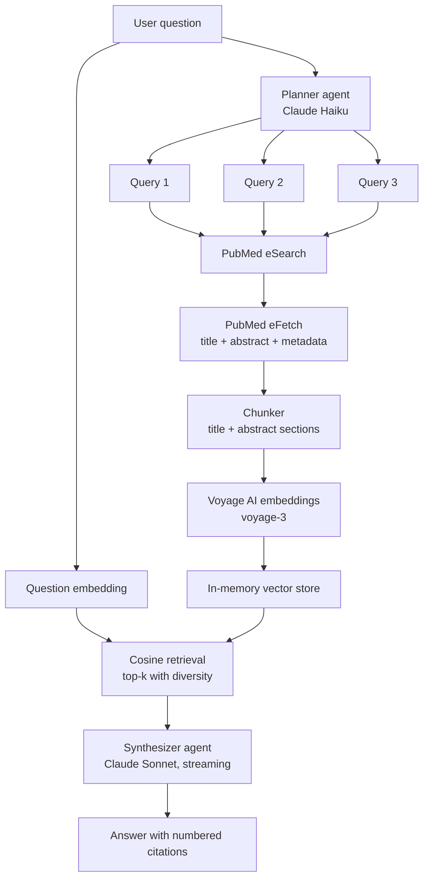

# Medical Literature Research Agent

An autonomous research agent that decomposes a clinical question, searches PubMed across multiple angles, retrieves the most relevant passages from real papers, and writes back a synthesized answer with verifiable citations.

Built with Next.js 14, the Anthropic Claude API, and Voyage AI embeddings. Streams every step of the agent's reasoning to the UI so the user can follow what it is doing.

## Screenshots


## What it does

You ask a clinical question in plain English. For example:

> What are recent outcomes for temozolomide in glioblastoma multiforme?

The agent then:

1. **Plans.** Decomposes the question into 2 to 4 focused PubMed search queries (using a fast Claude Haiku call).
2. **Searches.** Runs each query against the PubMed E-utilities API in parallel and deduplicates the resulting PMIDs.
3. **Fetches.** Pulls full records (title, abstract, authors, journal, year, MeSH terms) for each unique paper.
4. **Chunks.** Splits each paper into retrievable units, preserving section structure when PubMed abstracts use BACKGROUND/METHODS/RESULTS labels.
5. **Embeds.** Indexes every chunk using Voyage AI's `voyage-3` model in an in-memory vector store.
6. **Retrieves.** Cosine-similarity search returns the top passages most relevant to the original question, with per-paper diversity (no single paper dominates).
7. **Synthesizes.** A stronger Claude Sonnet model reads the retrieved passages and streams an answer back, with every claim cited inline using numbered references like an academic paper.

The user sees each of those steps appear in real time, then watches the answer stream in token-by-token, with clickable citation markers that scroll to the matching reference.

## Architecture



Each box is a single file in `lib/`. The orchestrator in `lib/agent/orchestrator.ts` wires them together and yields events as a typed async generator. The API route in `app/api/research/route.ts` serializes those events as Server-Sent Events for the frontend.

## Why this design

A few choices worth calling out, since this is a portfolio project as much as a working tool.

**Multi-query decomposition over single-query search.** A clinician asking about "outcomes for glioblastoma treatments" gets dramatically better evidence coverage from three targeted queries (temozolomide outcomes, bevacizumab efficacy, survival meta-analysis) than from one vague phrase. PubMed's BM25-style search rewards precise terminology.

**RAG with real embeddings, not context-stuffing.** With 20 to 40 papers per question, you could just paste all the abstracts into the Sonnet context window and skip retrieval. That approach drowns the model in irrelevant content and produces vaguer answers. Embedding-based retrieval surfaces the actually-relevant passages and keeps the answer tight.

**In-memory vector store.** Each query builds a fresh corpus that lives for the duration of one request. Spinning up Pinecone or Qdrant adds a network round-trip and an external dependency for no retrieval-quality benefit at this scale. The store interface is intentionally minimal, so swapping in a hosted vector DB for a long-lived corpus (a clinic's internal documents, for example) is a small change.

**Streaming events, not a single response.** Research agents take 10 to 30 seconds to finish. A blank loading spinner over a long wait feels broken. Streaming each step (plan, search, fetch, embed, retrieve, synthesize) makes the wait feel transparent and lets the user see exactly what evidence the answer was built from.

**Editorial-style UI.** Built to look like a research tool, not a chatbot clone. Cream paper background, serif body type, numbered citation markers as superscripts. The aesthetic itself is a signal to the user about how the system thinks about evidence.

**Friendly error handling.** Every failure mode in the pipeline (invalid API keys, PubMed rate limits, non-medical questions, network drops, expired Anthropic credit) is classified into a human-readable category with a clear explanation and actionable tip. The user never sees a raw stack trace or Zod validation error. The classification lives in `lib/errors.ts` as a single source of truth, so adding a new error type means writing one entry, not patching twenty try/catch blocks.

## Tech stack

| Layer | Tool | Why |
|---|---|---|
| Framework | Next.js 14 (App Router) | Server-rendered, easy to deploy on Vercel, native streaming support |
| Language | TypeScript (strict) | Self-documenting types across the agent boundary |
| LLM (planning) | Claude Haiku 4.5 | Fast and cheap, good enough for query decomposition |
| LLM (synthesis) | Claude Sonnet 4.6 | Stronger reasoning for the final answer |
| Embeddings | Voyage AI `voyage-3` | Anthropic's recommended embedding partner, free tier |
| Vector store | In-memory cosine | Right tool for per-query corpora |
| Data source | PubMed E-utilities | Free, authoritative, no scraping |
| Validation | Zod | Structured outputs from the planner |
| Styling | Tailwind CSS | Design tokens for the editorial aesthetic |

## Running locally

You need Node.js 20+ and an Anthropic API key. The PubMed key and Voyage key are recommended but the Voyage key is required for embeddings to work.

```bash
git clone https://github.com/your-username/medical-research-agent.git
cd medical-research-agent
npm install
cp .env.example .env.local
# fill in ANTHROPIC_API_KEY and VOYAGE_API_KEY at minimum
npm run dev
```

Open [http://localhost:3000](http://localhost:3000) and ask a question.

### Environment variables

| Name | Required | Where to get one |
|---|---|---|
| `ANTHROPIC_API_KEY` | yes | https://console.anthropic.com |
| `VOYAGE_API_KEY` | yes | https://www.voyageai.com (free tier, 50M tokens/month) |
| `NCBI_API_KEY` | no | https://www.ncbi.nlm.nih.gov/account/settings/ (raises rate limit from 3 to 10 req/sec) |
| `NCBI_TOOL_EMAIL` | no | Any email; NCBI etiquette for heavy users |

## Project structure

```
medical-research-agent/
├── app/
│   ├── api/research/route.ts    SSE endpoint that runs the agent
│   ├── layout.tsx               Root layout with fonts and metadata
│   ├── page.tsx                 Landing page composition
│   └── globals.css              Design tokens, fonts, paper texture
├── components/
│   ├── ChatInterface.tsx        Top-level client component, owns state
│   ├── AgentTrace.tsx           Step-by-step progress display
│   ├── AnswerPanel.tsx          Streaming answer with clickable citations
│   ├── CitationList.tsx         Numbered references at the bottom
│   └── ErrorPanel.tsx           Human-readable error display with tips
├── lib/
│   ├── agent/
│   │   ├── orchestrator.ts      The main agent loop
│   │   ├── planner.ts           Question -> PubMed queries
│   │   ├── chunker.ts           Paper -> retrieval chunks
│   │   └── synthesizer.ts       Retrieved chunks -> streaming answer
│   ├── pubmed/client.ts         eSearch + eFetch + XML parsing + rate limiting
│   ├── embeddings.ts            Voyage AI client
│   ├── vector-store.ts          In-memory cosine similarity
│   ├── llm.ts                   Anthropic client + structured outputs
│   ├── errors.ts                Error classification (raw -> user-friendly)
│   └── types.ts                 Shared types for the streaming protocol
└── README.md
```
